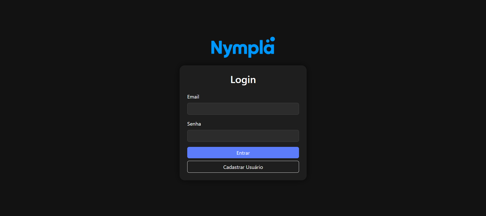
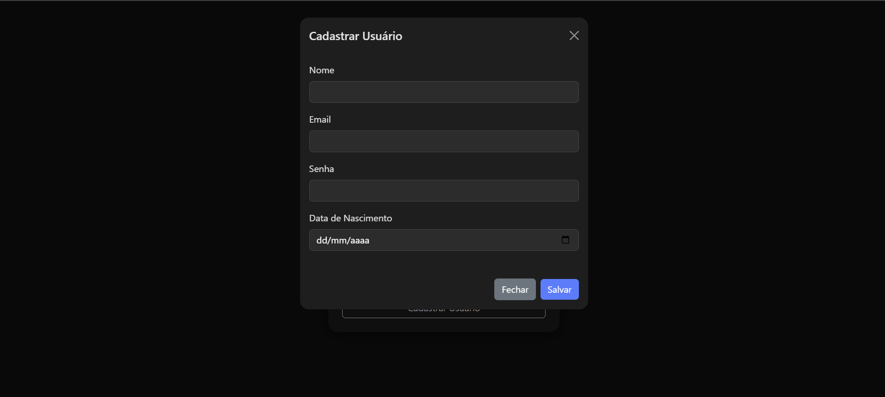
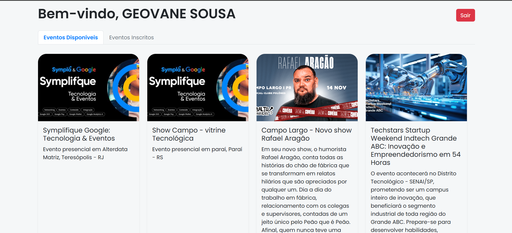
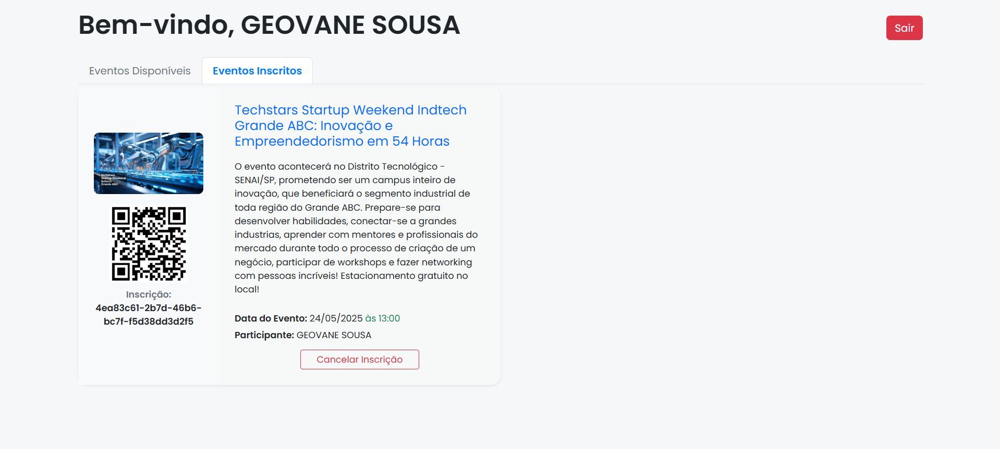
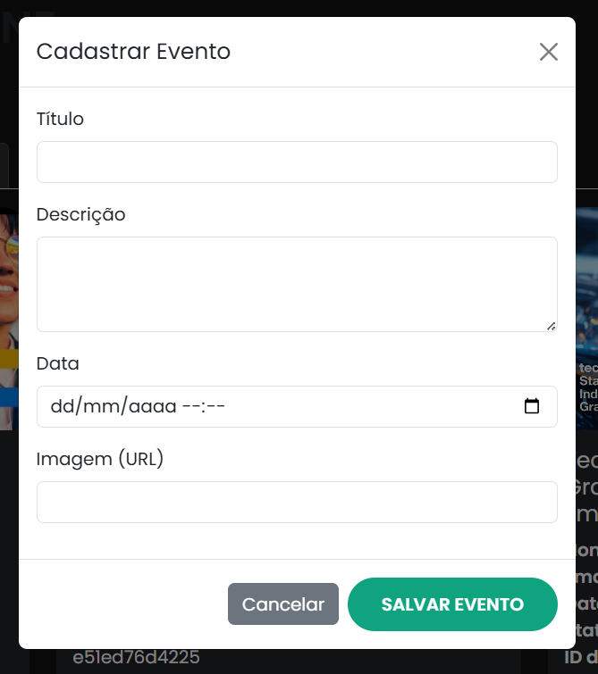
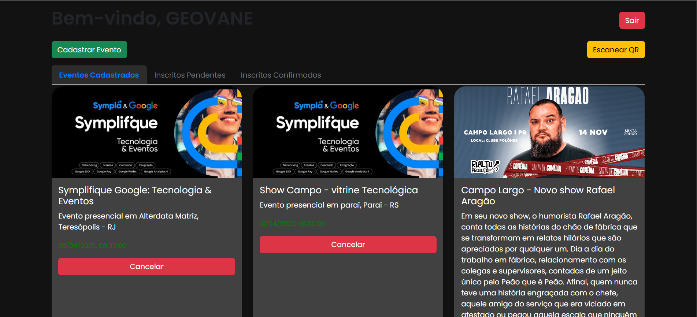
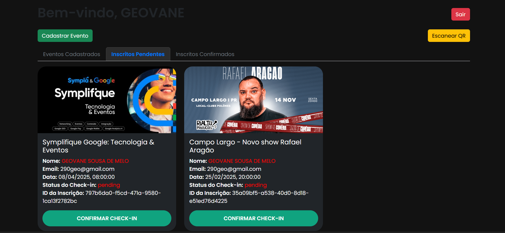
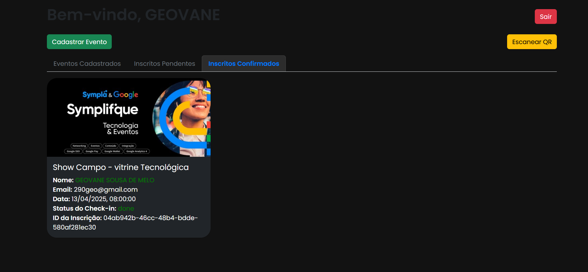
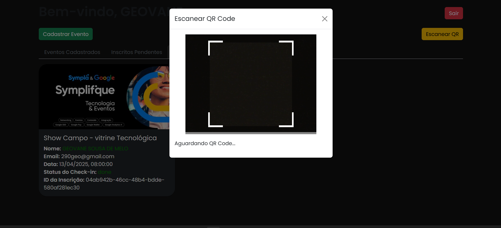
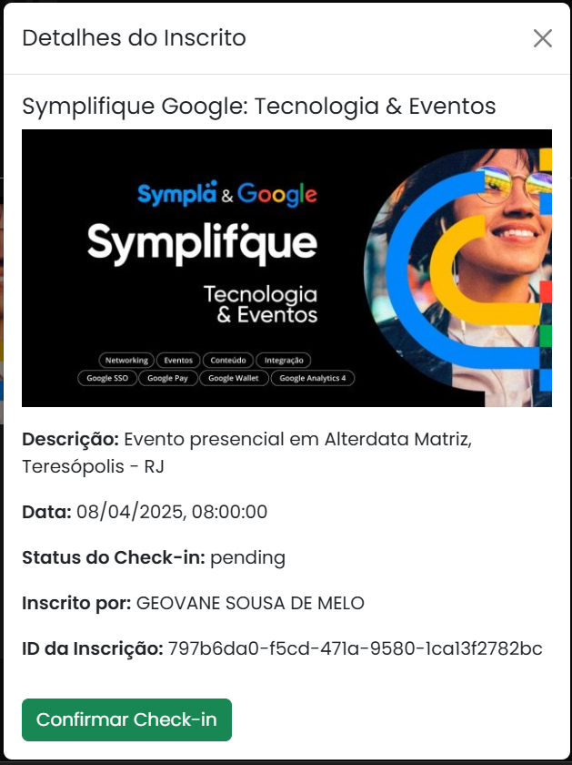

# Nympla

Nymbla é uma aplicação web moderna e responsiva, com tema escuro (dark mode), desenvolvida para gerenciar eventos e inscrições de maneira eficiente e intuitiva. A plataforma possui funcionalidades tanto para usuários participantes quanto para administradores, com autenticação, geração de QR Code e leitura em tempo real.

## ✨ Funcionalidades

### 🔐 Tela de Login
- Interface com tema escuro.
- Autenticação de usuário comum e administrador.
- Opção para criação de conta.



### 👤 Tela de Perfil (Usuário)
- Visualização de **todos os eventos disponíveis**.
- Possibilidade de se inscrever em eventos com apenas um clique.
- Aba dedicada para **eventos inscritos**, com:
  - Opção para cancelar para cada inscrição.
  - Geração de **QR Code** para cada inscrição.
- Botão para **logout** (sair da conta).



### 🛠️ Painel de Administração
- Botão para **cadastrar novos eventos**.
  
- Aba com lista de **eventos ativos**, com opção para:
  - **Cancelar** eventos existentes.
   
- Aba com lista de **inscrições pendentes**, com botão para:

  - **Confirmar check-in** dos usuários.
- Aba com lista de **inscrições confirmadas (done)**.

- Botão para **leitura de QR Code**:

  - Abre um modal que exibe dados completos da inscrição no banco de dados (via `pgAdmin`).
  
  - Mostra o `subscription_id`, dados do usuário, evento e status da inscrição.

  

---

## 🖥️ Tecnologias Utilizadas

- **Frontend**: HTML, CSS, JavaScript
- **Estilo**: Bootstrap com tema dark
- **Backend**: Node.js / Java / outro
- **Banco de Dados**: PostgreSQL (acessado via pgAdmin)
- **APIs**: RESTful
- **QR Code**: Geração e leitura integradas

---

## 🚀 Como Rodar o Projeto Localmente

1. Clone o repositório:
   ```bash
   git clone https://github.com/geovane833/Nympla
   cd nymbla
